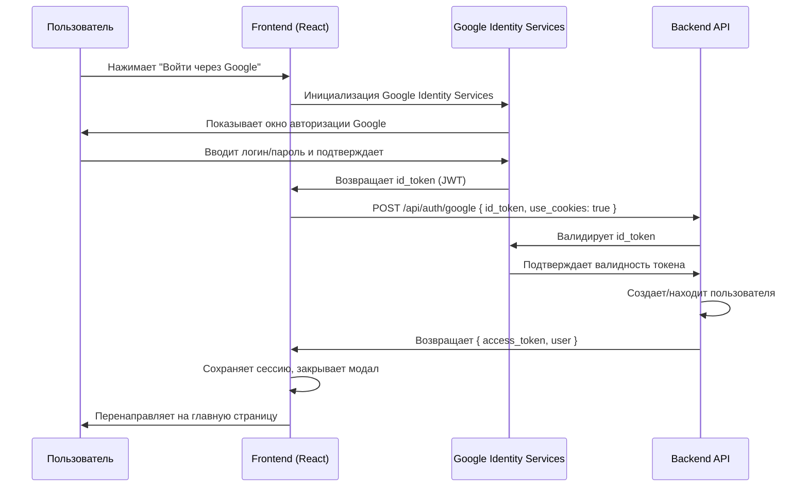
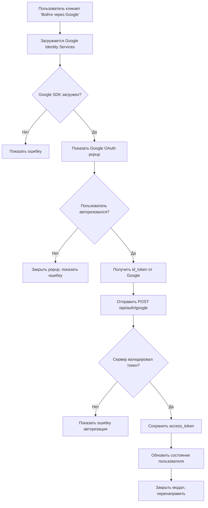

# Google OAuth Integration

## Процесс авторизации через Google



## Компоненты системы

### 1. Frontend Components

- **LoginForm** - Форма логина с кнопкой Google
- **RegisterForm** - Форма регистрации с кнопкой Google
- **useGoogleAuth** - Хук для интеграции с Google Identity Services
- **NavBar** - Навигационная панель с модалами форм

### 2. API Integration

- **googleAuth.ts** - Мутация для отправки Google токена на сервер
- **useGoogleAuth.ts** - Хук для работы с Google Identity Services

### 3. Flow диаграмма



## Настройка

### 1. Google Cloud Console

1. Создайте проект в [Google Cloud Console](https://console.cloud.google.com/)
2. Включите Google Identity API
3. Создайте OAuth 2.0 Client ID
4. Добавьте разрешенные домены:
   - `http://localhost:5173` (разработка)
   - Ваш продакшн домен

### 2. Environment Variables

```env
VITE_GOOGLE_CLIENT_ID=your-google-client-id.apps.googleusercontent.com
```

### 3. Backend Requirements

Backend должен поддерживать endpoint:

```typescript
POST /api/auth/google
Content-Type: application/json

Body: {
  id_token: string;
  use_cookies: boolean;
}

Response: {
  access_token: string;
  user: UserInfo;
}
```

## Безопасность

### 1. Валидация токена

Backend должен:
- Валидировать id_token через Google API
- Проверить audience (client_id)
- Проверить срок действия токена
- Извлечь email и другие данные пользователя

### 2. HTTPS Requirements

- В продакшене Google OAuth работает только с HTTPS
- В разработке разрешен localhost

### 3. CORS Settings

Убедитесь, что CORS настроен для вашего домена в Google Cloud Console.

## Troubleshooting

### Частые ошибки

1. **"Google Identity Services not loaded"**
   - Проверьте подключение к интернету
   - Убедитесь, что скрипт Google загружается

2. **"Invalid client_id"**
   - Проверьте VITE_GOOGLE_CLIENT_ID в .env
   - Убедитесь, что домен добавлен в Google Cloud Console

3. **"Token validation failed"**
   - Проверьте настройки backend
   - Убедитесь, что backend валидирует токен через Google API

### Debug режим

Для отладки добавьте в консоль браузера:

```javascript
// Проверить загрузку Google SDK
console.log('Google SDK:', window.google?.accounts?.id);

// Проверить Client ID
console.log('Client ID:', import.meta.env.VITE_GOOGLE_CLIENT_ID);
```

## Тестирование

### 1. Локальное тестирование

```bash
# Запустите dev сервер
npm run dev

# Откройте http://localhost:5173
# Нажмите "Войти через Google"
```

### 2. Проверка токена

Полученный id_token можно декодировать на [jwt.io](https://jwt.io) для проверки содержимого.

## Производительность

### 1. Lazy Loading

Google Identity Services загружается только при необходимости через динамический импорт скрипта.

### 2. Кэширование

SDK кэшируется браузером, повторные загрузки происходят быстрее.

### 3. Error Handling

Все ошибки обрабатываются gracefully с показом пользователю понятных сообщений.